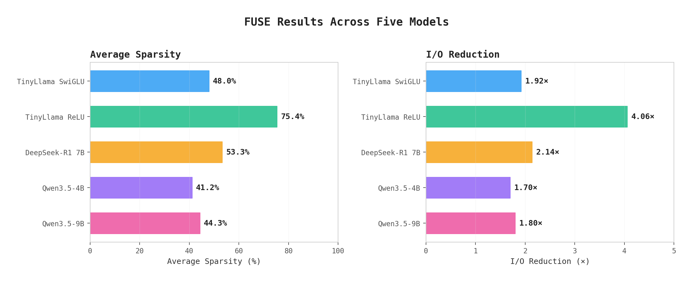
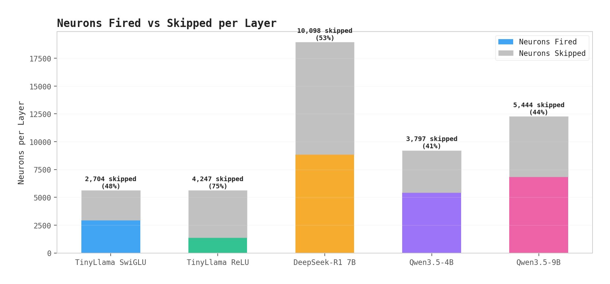
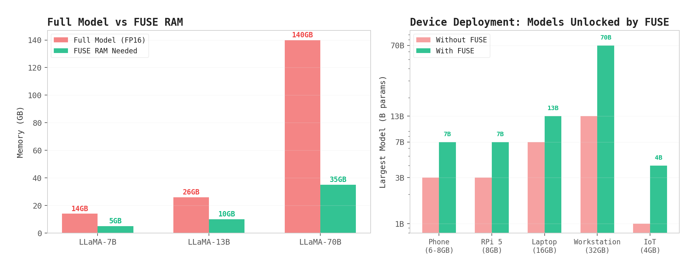
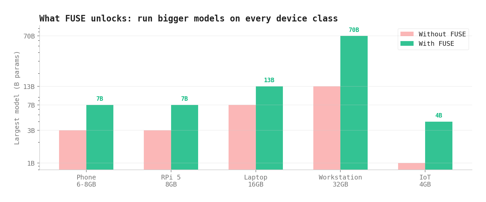
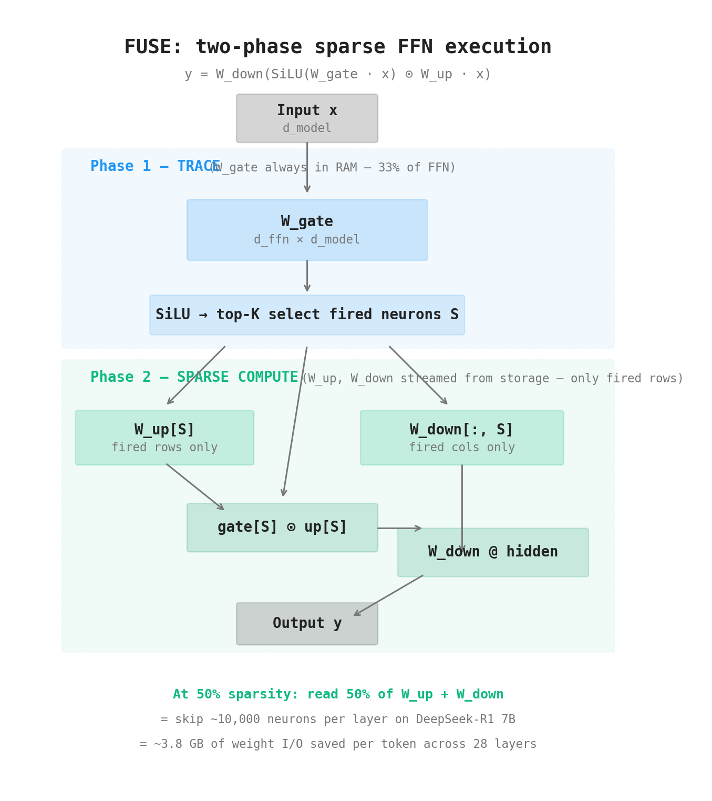
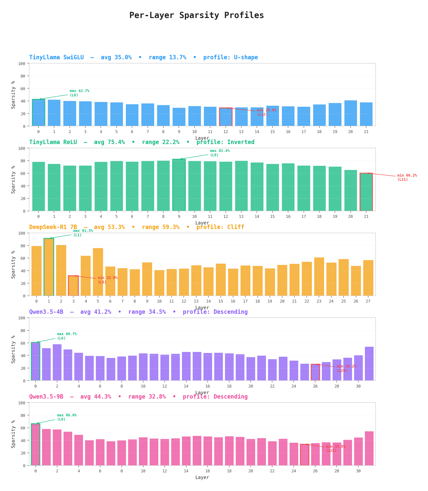

# FUSE: Feed-forward Unit-Sparse Execution

**Eliminating Activation Predictors for Sparse LLM Inference via Direct Gate Tracing**

> **Run a 70B model on a 32GB machine.** FUSE keeps only the gate weights in RAM (~33% of FFN), traces which neurons fire, and streams only those neurons from disk. No predictor training. No quantization. Full precision on every neuron that matters.

---

### Abstract

I present FUSE (Feed-forward Unit-Sparse Execution), a sparse inference method for SwiGLU-based large language models that eliminates the need for trained activation predictors. I observe that the gate projection W_gate — just 33% of FFN parameters — already encodes which neurons will fire for any given input. FUSE keeps W_gate resident in fast memory, computes gate activations to identify active neurons via top-K selection, and loads only the corresponding rows of W_up and W_down from storage. Unlike PowerInfer, Deja Vu, and LLM in a Flash, which require model-specific predictor training, FUSE uses the model's own gating mechanism as a zero-cost, exact activation tracer. I further introduce a per-layer adaptive calibration algorithm that binary-searches each layer's maximum sparsity above a cosine similarity floor, replacing uniform sparsity targets that ignore layer heterogeneity. I validate FUSE across five models spanning three architecture families — LLaMA (TinyLlama 1.1B), Qwen2 (DeepSeek-R1-Distill-Qwen-7B), and Qwen3.5 (4B and 9B with hybrid Gated DeltaNet attention) — with zero code changes. On DeepSeek-R1 7B, adaptive calibration achieves 53.3% average sparsity (2.1x I/O reduction) at cos ≥ 0.95 with per-layer targets ranging from 32% to 91%. On ReLUfied TinyLlama, FUSE reaches 75.4% sparsity (4.1x I/O reduction) at cos ≥ 0.98. On Qwen3.5-9B, FUSE achieves 44.3% sparsity (1.8x I/O reduction), revealing a novel descending-slope layer sensitivity profile characteristic of the hybrid DeltaNet/attention architecture. Multi-step arithmetic reasoning (17 × 23 = 391) is fully preserved across all models. The approach requires no training, no quantization, and no architecture modification — only a one-time calibration pass.

---

## Key Results

| Model | Sparsity | I/O Reduction | Neurons Fired | Neurons Skipped | Reasoning |
|---|---|---|---|---|---|
| TinyLlama 1.1B (SwiGLU) | 35.0% | 1.54x | 3,668 / 5,632 per layer | ~2,000 skipped | ✓ |
| TinyLlama 1.1B (ReLUfied) | **75.4%** | **4.06x** | ~1,385 / 5,632 per layer | ~4,247 skipped | ✓ |
| DeepSeek-R1 7B (SwiGLU) | **53.3%** | **2.14x** | ~8,849 / 18,944 per layer | ~10,095 skipped | **17×23=391 ✓** |
| Qwen3.5-4B (SwiGLU+DeltaNet) | 41.2% | 1.70x | ~5,418 / 9,216 per layer | ~3,798 skipped | **17×23=391 ✓** |
| Qwen3.5-9B (SwiGLU+DeltaNet) | 44.3% | 1.80x | ~6,847 / 12,288 per layer | ~5,441 skipped | **17×23=391 ✓** |

Validated across **five models, three architecture families** (LLaMA, Qwen2, Qwen3.5) with **zero code changes**. Multi-step arithmetic reasoning is fully preserved in every case — even on Qwen3.5's novel hybrid Gated DeltaNet + full attention architecture.



### What This Means in Practice

Every skipped neuron is a row of W_up and a column of W_down that **never needs to leave storage**. On DeepSeek-R1 7B, that's ~10,000 neurons × 3,584 dimensions × 2 bytes × 2 matrices = **~137 MB of weight reads avoided per layer, per token.** Across 28 layers, that's **~3.8 GB of I/O saved per token** — weight data that stays on disk instead of being streamed through memory bandwidth.



## Run Models That Don't Fit in Memory

FUSE's core practical benefit: **run models far larger than your available RAM.**

W_gate is only 33% of FFN parameters, and FFN is ~67% of total model params. Keep W_gate + attention weights + KV cache in RAM, stream W_up and W_down sparsely from SSD. You only read the neurons that fire.

| Model | Full Size (FP16) | FUSE RAM Needed | What You Save |
|---|---|---|---|
| LLaMA-7B | 14 GB | ~5 GB | Run on 8GB laptop |
| LLaMA-13B | 26 GB | ~10 GB | Run on 16GB laptop |
| LLaMA-70B | 140 GB | ~35 GB | Run on a single workstation |

At 50% sparsity, you read only half of W_up/W_down per token from NVMe. At 90% (ReLUfied), you read 1/10th. The weights you don't read never need to be in RAM — they stay on disk until a neuron fires.

**This is not quantization.** The neurons you do load are full precision. FUSE is orthogonal to quantization — combine both for compounded savings (e.g., 50% sparsity × 4-bit quantization = 8x total reduction).

### Beyond Laptops: Mobile, IoT, and Embedded

FUSE's memory model makes LLM inference feasible on devices that were previously out of reach:

| Device | Available RAM | Without FUSE | With FUSE (50% sparsity) |
|---|---|---|---|
| iPhone / flagship Android | 6-8 GB | 3B models max | **7B models** with NVMe streaming |
| Raspberry Pi 5 | 8 GB | 3B models max | **7B models** from SD card |
| Edge server (32 GB) | 32 GB | 13B models max | **70B models** from NVMe |
| IoT gateway (4 GB) | 4 GB | 1B models max | **3-4B models** from flash storage |

The key insight: mobile devices and IoT hardware already have fast flash storage (UFS 4.0 on phones delivers ~4 GB/s sequential read). FUSE turns that storage bandwidth into usable inference throughput. W_gate fits in RAM as a lightweight index; the heavy weights stream on demand.





## The Idea



In a standard SwiGLU FFN:

```
y = W_down @ (SiLU(W_gate @ x) * W_up @ x)
```

The gate activation `SiLU(W_gate @ x)` directly controls each neuron's contribution. If `|gate[i]|` is small, neuron `i` contributes almost nothing regardless of W_up and W_down. FUSE uses this to skip those neurons entirely:

```
Phase 1 — TRACE:   Compute gate = SiLU(W_gate @ x)     ← always in memory (33% of FFN)
                    Select top-K neurons by |gate|

Phase 2 — SPARSE:  Load only W_up[fired] and W_down[:, fired]  ← from disk/SSD
                    Compute sparse output with fired neurons only
```

**W_gate is the predictor.** Prior work (PowerInfer, Deja Vu, LLM in a Flash) trains separate predictor networks. FUSE eliminates that entirely.

## What's Novel

| Prior Work | What They Do | What FUSE Does Differently |
|---|---|---|
| PowerInfer | Trained predictor → hot/cold neuron split | Gate IS the predictor — no training |
| Deja Vu | Trained MLP predictor per layer | Gate IS the predictor — no training |
| LLM in a Flash | Precomputed activation stats | Gate gives exact per-token activation |
| CATS / MoC | Gate for compute savings on GPU | Gate for **I/O savings** from disk |

FUSE fills the gap: **direct gate tracing for I/O-optimized sparse inference.**

## Per-Layer Adaptive Calibration

Not all layers are equal. Applying 40% sparsity everywhere wastes budget: sensitive layers lose quality while tolerant layers leave savings on the table.

FUSE's calibrator binary-searches each layer's maximum safe sparsity:

```
DeepSeek-R1 7B — Per-layer sparsity profile:

L 0  ██████████████████████████████████████░░  79.2%   ← highly prunable
L 1  ████████████████████████████████████████  91.3%   ← 9/10 neurons skippable!
L 2  █████████████████████████████████████░░░  80.9%
L 3  ███████████████░░░░░░░░░░░░░░░░░░░░░░░░  32.0%   ← critical bottleneck
L 4  ████████████████████████████░░░░░░░░░░░░  63.6%
...
L27  █████████████████████████░░░░░░░░░░░░░░░  56.6%

Range: 32.0% — 91.3% (59.3% spread!)
```

This pushed DeepSeek-R1 7B from 40% (flat) to 53.3% (adaptive) — a 33% relative improvement at the same quality.

## Quick Start

### Install

```bash
pip install torch transformers accelerate "lm-eval[hf]"
```

### 1. Analyze a model's sparsity potential

```bash
# Quick analysis at 50% sparsity
python fuse_analyze.py --target-sparsity 0.5

# Sweep all sparsity levels to find the sweet spot
python fuse_analyze.py --sweep

# Try ReLUfication (much higher sparsity)
python fuse_analyze.py --sweep --relufied
```

### 2. Calibrate per-layer adaptive sparsity

```bash
# Calibrate TinyLlama (takes ~30s with vectorized calibrator)
python fuse_calibrate.py --quality-floor 0.95 --output schedules/tinyllama_95.json

# Calibrate DeepSeek-R1 7B
python fuse_calibrate.py \
  --model deepseek-ai/DeepSeek-R1-Distill-Qwen-7B \
  --quality-floor 0.95 \
  --dtype float16 \
  --output schedules/deepseek7b_95.json

# ReLUfied calibration
python fuse_calibrate.py --relufied --quality-floor 0.98 --output schedules/tinyllama_relu_98.json
```

### 3. Generate text with FUSE

```bash
# Uses calibration schedule, auto-detects model
python fuse_inference.py \
  --schedule schedules/deepseek7b_95.json \
  --dtype float16 \
  --prompt "What is 17 * 23? Think step by step."

# Compare dense vs sparse side-by-side
python fuse_inference.py \
  --schedule schedules/deepseek7b_95.json \
  --dtype float16 \
  --compare \
  --prompt "The future of AI is"

# Without a schedule (flat sparsity)
python fuse_inference.py --target-sparsity 0.4 --prompt "Hello world"
```

### 4. Benchmark on real tasks (GSM8K, MMLU, etc.)

```bash
# Quick sanity check — 50 examples of GSM8K
python fuse_eval.py \
  --schedule schedules/deepseek7b_95.json \
  --tasks gsm8k \
  --limit 50

# Full GSM8K evaluation (1,319 problems, takes 2-4 hours)
python fuse_eval.py \
  --schedule schedules/deepseek7b_95.json \
  --tasks gsm8k \
  --output results/deepseek7b_gsm8k.json

# Multiple benchmarks at once
python fuse_eval.py \
  --schedule schedules/deepseek7b_95.json \
  --tasks gsm8k,mmlu,hellaswag \
  --output results/deepseek7b_full.json

# Dense baseline only (if you want it separately)
python fuse_eval.py \
  --model deepseek-ai/DeepSeek-R1-Distill-Qwen-7B \
  --dtype float16 \
  --tasks gsm8k \
  --dense-only

# Sparse only (skip dense re-run, pass previous dense score)
python fuse_eval.py \
  --schedule schedules/deepseek7b_95.json \
  --tasks gsm8k \
  --sparse-only \
  --dense-baseline '{"gsm8k": 78.2}'
```

## Project Structure

```
FUSE/
├── README.md
├── requirements.txt
├── LICENSE
│
├── fuse_analyze.py       # Analysis tool: per-layer stats, sparsity sweeps
├── fuse_calibrate.py     # Per-layer adaptive calibration (vectorized)
├── fuse_inference.py     # Text generation with FUSE-patched forward pass
├── fuse_eval.py          # Benchmark evaluation (GSM8K, MMLU, etc.)
├── gate_tracer.py        # Original NumPy prototype + neuron-indexed storage
│
├── build_paper.py        # Generates the demo paper PDF
├── generate_figures.py   # Generates chart PNGs for paper/README
│
├── figures/              # Generated charts (6 PNGs)
├── schedules/            # Pre-computed calibration schedules
│   ├── tinyllama_98.json
│   ├── tinyllama_95.json
│   ├── tinyllama_relu_98.json
│   ├── deepseek7b_95.json
│   ├── qwen35_4b_95.json
│   └── qwen35_9b_95.json
└── results/              # Benchmark evaluation outputs
```

| File | What It Does |
|---|---|
| `fuse_analyze.py` | Hooks into a model, runs dense vs sparse comparison per layer, reports cosine similarity, relative error, I/O savings. Supports sparsity sweeps. |
| `fuse_calibrate.py` | Runs calibration sentences through the model, binary-searches each layer's max safe sparsity, saves a JSON schedule. Vectorized — 6 min for 7B models. |
| `fuse_inference.py` | Monkey-patches model's MLP forward passes with FUSE sparse execution. Generates text using `model.generate()`. Loads per-layer schedules. |
| `fuse_eval.py` | Runs standard benchmarks (GSM8K, MMLU, etc.) on both dense and FUSE-sparse models using lm-evaluation-harness. Outputs comparison tables and JSON results. |
| `gate_tracer.py` | NumPy prototype with neuron-indexed storage format and throughput projections for 7B–70B models. |

## Experimental Results

### Layer Sensitivity Profiles

Five models across three architecture families show qualitatively different profiles, each revealing architectural structure:



**TinyLlama SwiGLU (U-shape):** Early/late layers tolerant (37–43%), middle layers sensitive (29–30%). Small model = uniform utilization = narrow 13.6% range.

**TinyLlama ReLUfied (inverted):** ReLU creates hard zeros → middle layers become most prunable (78–82%), final layers resist (60–70%). Sparsity jumps from 35% → 75.4%.

**DeepSeek-R1 7B (cliff):** Layers 0–2 extremely prunable (79–91%), layer 3 drops to 32% (critical reasoning bottleneck), gradual recovery through middle/late layers. The 59.3% range confirms larger models benefit most from per-layer calibration.

**Qwen3.5-4B (descending slope):** Early layers most tolerant (60.7% at L0), steady descent to bottleneck at L25–26 (~26%), then sharp recovery at L31 (53.8%). The late bottleneck coincides with full-attention "checkpoint" layers in the 3:1 DeltaNet/attention hybrid architecture.

**Qwen3.5-9B (same slope, more headroom):** Nearly identical shape to 4B — confirming the descending-slope profile is an architectural signature of Qwen3.5's hybrid design. The larger model is uniformly more sparse-friendly (bottleneck improves from 26.2% → 33.8%, overall from 41.2% → 44.3%).

### Adaptive vs Flat Sparsity

| Model | Flat Sweet Spot | Adaptive Avg | Relative Gain |
|---|---|---|---|
| TinyLlama SwiGLU | 30% | 35.0% | +16.7% |
| TinyLlama ReLUfied | 60% | 75.4% | +25.7% |
| DeepSeek-R1 7B | 40% | **53.3%** | **+33.3%** |

The gain increases with model size — larger models have more heterogeneous layers.

### Reasoning Preservation

All models tested on "What is 17 × 23? Think step by step." produce the correct answer (391) with coherent step-by-step reasoning:

**DeepSeek-R1 7B** (53.3% sparse) — decomposes as 17×20+17×3, then self-verifies the result.

**Qwen3.5-4B** (41.2% sparse) — uses full FOIL expansion: (10+7)×(20+3) = 200+30+140+21 = 391.

**Qwen3.5-9B** (44.3% sparse) — provides textbook-quality pedagogy: breaks down 17×20 as "17×2=34, therefore 17×20=340", then adds 17×3=51.

Each model chooses a different valid solution strategy, demonstrating that FUSE preserves reasoning capability — not just surface-level token reproduction.

## Projected Impact

For models too large to fit in GPU memory, FUSE enables disk-streaming inference:

| Model | W_gate in RAM | Sparsity | I/O per Token | NVMe Gen4 | NVMe Gen5 |
|---|---|---|---|---|---|
| LLaMA-7B | 3.0 GB | SwiGLU 50% | 3.0 GB | 2.3 tok/s | 4.7 tok/s |
| LLaMA-7B | 3.0 GB | ReLU 90% | 0.6 GB | 11.7 tok/s | 23.3 tok/s |
| LLaMA-70B | 30.2 GB | SwiGLU 50% | 30.2 GB | 0.2 tok/s | 0.5 tok/s |
| LLaMA-70B | 30.2 GB | ReLU 90% | 6.0 GB | 1.2 tok/s | 2.3 tok/s |

## Roadmap

- [x] Gate-as-tracer prototype with neuron-indexed storage
- [x] Top-K selection for SwiGLU models (non-ReLU compatible)
- [x] Analysis tool with sparsity sweeps
- [x] Working text generation with FUSE-patched forward pass
- [x] Per-layer adaptive calibration (vectorized)
- [x] Validated on DeepSeek-R1 7B (reasoning preserved at 53% sparsity)
- [ ] Benchmark evaluation (GSM8K, MMLU, HumanEval)
- [ ] GPU-optimized Triton kernels for HBM bandwidth reduction
- [ ] Disk-streaming engine with neuron-indexed storage
- [ ] Test on properly ReLU-fined models (ReluLLaMA-7B)
- [ ] Combine with INT4/INT8 quantization for compounded savings

## How to Cite

```bibtex
@misc{egeli2026fuse,
  title={FUSE: Eliminating Activation Predictors for Sparse LLM Inference via Direct Gate Tracing},
  author={Egeli, Cenk Burak},
  year={2026},
  url={https://github.com/torchd3v/FUSE}
}
```

## License

Apache License 2.0. See [LICENSE](LICENSE) for details.